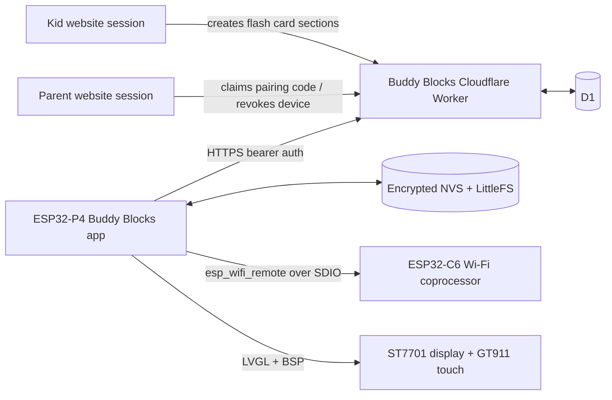

# Buddy Blocks ESP32-P4 App Project Specification

Status: implementation specification

Target hardware: Waveshare ESP32-P4-WIFI6-Touch-LCD-4.3

Required orientation: landscape, 800 × 480 logical pixels

Initial feature scope: Multiplication Facts Lab and child-authored flash card sections

Last researched: 2026-08-23

## 1. Purpose

Build a dedicated Buddy Blocks touchscreen application for the Waveshare ESP32-P4-WIFI6-Touch-LCD-4.3. The device must let a child practice multiplication facts and study flash card sections created on the Buddy Blocks website. It must remain useful without a network connection and synchronize content and activity when Wi-Fi returns.

The ESP32 application is a native ESP-IDF/LVGL firmware project. It is not a browser wrapper and does not attempt to port Astro, Preact, or the complete Buddy Blocks curriculum.

This document is the source of truth for the firmware, the device-facing Cloudflare Worker APIs, the website pairing UI, and the release process.

## 2. Product Decisions

These decisions are fixed for the first production version:

- The board is normally held in landscape orientation. The UI always presents an 800 × 480 logical canvas even though the panel's native coordinate system is 480 × 800.
- One physical device is paired with exactly one active child profile at a time.
- Pairing a device requires parent authorization. After pairing, the child can use it without a password.
- Wi-Fi setup and management happen on the touchscreen. Bluetooth provisioning and phone-app provisioning are not required.
- Wi-Fi is optional during ordinary use. Previously synchronized flash cards, multiplication practice, and queued activity work offline.
- The website's child mode is the required flash card authoring surface. A logged-in child can create and manage `My Flash Cards`; this capability must not be moved behind parent mode. The ESP32 app is read-only for flash card content.
- Multiplication uses the existing 1s-through-12s rules, adaptive weighting, timed modes, fluency thresholds, idempotent submission behavior, and XP policy.
- Multiplication answers use an on-screen numeric keypad. Voice input is not included in the first version.
- Flash cards use a simple reveal-and-rate study flow on the device. The website's three-stage vocabulary quiz player is not ported.
- Camera, microphones, audio recording, BLE, full curriculum courses, parent dashboards on the device, and arbitrary web browsing are out of scope.
- Internal NOR flash is sufficient for version 1. A microSD card must not be required.
- Development builds remain easy to flash over USB-UART. Production builds use signed OTA, rollback, Secure Boot, and flash/NVS encryption.

## 3. Success Criteria

The project is successful when all of the following are true:

1. A freshly flashed board boots into a responsive, correctly rotated landscape UI.
2. A parent can configure a 2.4 GHz Wi-Fi network from the touchscreen, pair the board to a child through the website, and name or revoke the device.
3. Flash card sections created or changed by the child on the website appear on the device after synchronization.
4. The device can cold-boot with no network and immediately use the last synchronized flash card library and multiplication mastery data.
5. Completed multiplication sessions and flash card study summaries survive power loss and synchronize exactly once after connectivity returns.
6. A revoked device credential cannot read child data or submit activity.
7. A failed firmware update automatically returns to the previous working image.
8. The app survives a seven-day family pilot without crashes, corrupt storage, lost queued sessions, or a need for serial-console intervention.

## 4. Hardware and Software Baseline

### 4.1 Verified board capabilities

The target board contains:

- ESP32-P4NRW32 application processor with dual high-performance RISC-V cores and a low-power core.
- 32 MB in-package PSRAM and 32 MB external NOR flash.
- ESP32-C6-MINI-1 wireless coprocessor connected over SDIO, providing 2.4 GHz Wi-Fi 6 and Bluetooth LE.
- 4.3-inch, 480 × 800 IPS panel using two-lane MIPI-DSI and an ST7701 controller.
- GT911 capacitive touch controller with up to five touch points.
- USB-UART and USB 2.0 High-Speed OTG Type-C ports.
- A microSD slot, ES8311 audio codec, ES7210 audio front end, microphones, speaker header, battery header, camera connector, and 40-pin expansion header. These are not required by version 1.

The [Waveshare product documentation](https://docs.waveshare.com/ESP32-P4-WIFI6-Touch-LCD-4.3) and [Waveshare engineering repository](https://github.com/waveshareteam/ESP32-P4-WIFI6-Touch-LCD-4.3) are the authoritative board references. Pinouts and electrical details must be checked against the schematic and the revision physically printed on the board before changing BSP defaults.

### 4.2 Required toolchain

Use the following pinned baseline for the first working release:

- ESP-IDF `v5.5.5`.
- Target `esp32p4`.
- LVGL 9 through the board BSP.
- Waveshare component `waveshare/esp32_p4_wifi6_touch_lcd_4_3==1.0.1`.
- `espressif/esp_hosted==1.4.7`, the ESP-IDF 5.x host line pinned by the
  Waveshare board example and factory Brookesia firmware.
- `espressif/esp_wifi_remote==0.14.5`, the matching ESP-IDF 5.x remote Wi-Fi
  line pinned by the Waveshare factory source.
- C and C++17, with exceptions and RTTI disabled unless a measured dependency requires them.

Waveshare currently validates its examples against ESP-IDF 5.5.5 and 6.0.2, and its factory source is based on 5.5.5. Start with 5.5.5 to minimize bring-up variables. Add an ESP-IDF 6.0 build lane only after the device passes the version 1 acceptance suite.

The board-specific BSP was published in August 2026. It uses 30 MHz DPI timing, two DSI lanes at 500 Mbps, and GT911 polling with address probing. Do not copy configuration from the older generic `ESP32-P4-WIFI6-Touch-LCD-X` BSP or from a different display size.

### 4.3 Silicon revision handling

The Waveshare repository describes separate ESP32-P4 silicon profiles:

- Rev3.x default: minimum revision 3.0 and 250 MHz PSRAM.
- Rev1.3 compatibility: minimum revision 1.0 and 200 MHz PSRAM.

The hardware bring-up step must record the board revision using `esptool.py chip_id`, boot logs, and `esp_chip_info()`. Maintain two explicit sdkconfig overlays if both profiles are needed:

- `sdkconfig.defaults.rev3` for the production board in hand.
- `sdkconfig.defaults.rev1_3` for compatibility CI and explicitly labeled recovery images.

Never flash a revision-specific production image onto an unverified board. CI compilation is not evidence that display timing, PSRAM timing, or touch behavior works on physical hardware.

### 4.4 Landscape display requirement

The UI coordinate system is always 800 pixels wide by 480 pixels tall.

The panel is native portrait and its MIPI-DSI DPI/video-mode path must not be assumed to support controller rotation. The SeedSigner ESP32-P4 project has already run this exact Waveshare board in landscape and is the most useful independent implementation reference. Its current approach renders an 800 × 480 LVGL surface and rotates the RGB565 output into the portrait scanout path. It also reports that generic `lv_display_set_rotation()` was not reliable in its stack. Buddy Blocks must reproduce and measure the result; it must not blindly copy configuration from another BSP or LVGL version.

Bring-up must evaluate these paths in order:

1. Test the pinned Waveshare BSP's supported software-rotation path on the physical board. Accept it only if it renders the complete surface, survives repeated navigation, and has no tearing or buffer corruption.
2. If that path fails or performs poorly, implement a SeedSigner-informed custom landscape flush: LVGL renders 800 × 480, and a dedicated flush task rotates 90 degrees into the native 480 × 800 DSI framebuffer before signaling completion.
3. Benchmark PPA-assisted rotation only if the pinned ESP-IDF/component versions are stable on this board. Keep the CPU rotation fallback until PPA has passed the full hardware checklist.

Use two full RGB565 source buffers in PSRAM when the chosen LVGL render mode permits. Each 800 × 480 buffer is approximately 750 KiB. MIPI-DSI framebuffers and draw buffers must meet ESP-IDF alignment and cache-coherency requirements. Keep rotation and any wait-for-vsync work outside the LVGL mutex where possible. Record frame time, flush time, input latency, tearing observations, and internal/PSRAM watermarks for every candidate rather than choosing by nominal capability.

The landscape transform must have one owner. Runtime display dimensions, compile-time dimension helpers, screenshots, and touch mapping must all agree on 800 × 480. The SeedSigner implementation uses the equivalent of `swap_xy = true`, `mirror_x = true`, and `mirror_y = false` for this physical orientation; treat that as the first test case, not an unverified constant. The hardware test must touch all four corners, the center, and a 5 × 3 target grid. A build is not accepted if display rotation is correct but touch coordinates are mirrored, offset, or transposed.

## 5. Scope

### 5.1 Version 1 features

- Native Buddy Blocks home screen.
- Existing child-mode website authoring remains the source of flash card sections synchronized to the device.
- Multiplication Facts Lab:
  - tables 1 through 12;
  - one or more selected tables;
  - Needs Practice preset;
  - endless practice;
  - 60-second and 120-second time tests;
  - adaptive question weighting;
  - missed-fact requeueing;
  - on-screen numeric keypad;
  - mastery overview and recent personal best;
  - offline session queue and idempotent upload.
- Flash card sections:
  - active sections synchronized from the website;
  - pinned section shown first;
  - section title, source, front, back, and optional clue;
  - reveal answer;
  - `Again` and `Got it` ratings;
  - missed card requeueing after three other cards;
  - round summary;
  - offline study history queue.
- Touchscreen Wi-Fi manager.
- Parent-authorized device pairing.
- Manual sync and automatic background sync.
- Offline status and last-sync status.
- Settings, diagnostics, factory reset, and OTA update UI.
- Cloudflare Worker device APIs, D1 migrations, parent device management UI, automated tests, firmware CI, and release documentation.

### 5.2 Explicit non-goals

- Porting standard Buddy Blocks courses or the general lesson player.
- Creating, editing, reordering, pinning, archiving, or restoring flash card sections on the device.
- Voice answers, speech recognition, audio recording, camera features, or video.
- Bluetooth provisioning, BLE app control, Thread, Zigbee, or ESP-NOW.
- WPA-Enterprise, captive-portal automation, or 5 GHz Wi-Fi.
- Multiple child profiles on one device.
- Parent reporting dashboards on the device.
- A public fleet-management SaaS.
- Requiring a microSD card.

## 6. User Experience Specification

### 6.1 Visual system

Reproduce the Buddy Blocks visual language with embedded assets, not web fonts or remote resources.

Core tokens:

| Token | Value | Use |
| --- | --- | --- |
| Ink | `#242134` | primary text and strong borders |
| Muted | `#645D79` | secondary text |
| Berry | `#E63E80` | primary actions |
| Berry dark | `#A91F55` | pressed/error emphasis |
| Reward | `#FFD84D` | highlights and pinned state |
| Teal | `#18BCA4` | success and online state |
| Build blue | `#5B79FF` | multiplication accents |
| Action orange | `#FF7F45` | attention state |
| Wash | `#FFF1F7` | top/background tint |
| Mint | `#F0FFF9` | bottom/background tint |
| Paper | `#FFFFFF` | cards and dialogs |

Use Fredoka for display text and Nunito or Atkinson Hyperlegible for body text if their licenses permit embedding. Subset fonts to the Latin characters needed by the app and current flash card constraints. The firmware must still render unknown UTF-8 characters safely with a replacement glyph; it must never crash on unsupported text.

Minimum interaction requirements:

- 52 × 52 pixel minimum touch targets; prefer 60 pixels for primary controls.
- 20 pixel minimum body text and 16 pixel minimum tertiary text.
- Text and icons together for status; color alone is insufficient.
- Keyboard focus is not required, but all actions need visible pressed and disabled states.
- Avoid scroll-dependent primary actions. Keep Back, Finish, Submit, and Retry visible.
- Animations are 150 ms or shorter and can be disabled in Settings.
- Use single-touch interactions only even though the controller supports multi-touch.

### 6.2 SeedSigner-informed interaction model

Use the [SeedSigner MicroPython builder](https://github.com/kdmukai/seedsigner-micropython-builder/) as a behavioral and hardware reference for touchscreen navigation on this board. Buddy Blocks keeps its own visual identity, native ESP-IDF architecture, data model, and kid-focused language. Do not copy SeedSigner source code, icons, fonts, or other assets unless their license and provenance have been reviewed and recorded.

Adapt these proven interaction patterns:

- A stable top navigation region with a consistent Back location and an optional contextual icon.
- Large rows or tiles whose entire visible surface is tappable.
- Distinct rest, pressed, selected, checked, disabled, correct, and incorrect states. Pressed is momentary; selected persists.
- Leading icons or radio/checkbox marks for meaning and a trailing chevron only when the row opens another screen.
- A bottom-pinned confirmation bar for selections, confirmations, and destructive actions. It must not move when list content scrolls.
- Remember the selected item when returning to a list and reveal it immediately without animating the list from the top.
- No artificial highlighted first row in touch mode. A row looks selected only after the child selects it or when it represents persisted state.
- Scroll the selected row into view after a touch or programmatic restore. Never allow an off-screen option to be committed accidentally.

Implement these as shared `buddy_ui` components rather than screen-specific styling:

| Component | Contract |
| --- | --- |
| `TopNav` | fixed title, Back, optional context icon, and optional safe status action |
| `OptionTile` | label, optional description/icon, variant, checked state, enabled state, and stable value ID |
| `OptionList` | single- or multi-select rows, remembered selection, bounded scrolling, and selection visibility |
| `ChoiceGrid` | landscape 2 × 2 quiz choices for two to four answers; switches to `OptionList` for five or more |
| `ConfirmBar` | fixed primary action plus optional secondary action; primary is disabled until the state is valid |
| `SelectionModel` | pure state machine that separates highlight/selection from commit and never relies on widget pointers as business values |

`ChoiceGrid` establishes the interaction contract for future multiple-choice lessons but does not add the website flash-card quiz player to version 1. Version 1 uses the same option/selection components for multiplication tables, modes, Wi-Fi networks, settings, and confirmations.

Quiz and form commit rules:

- Tapping a quiz answer selects it and gives immediate visible feedback. A separate fixed `Check answer` button commits it. This prevents a stray touch from submitting the wrong answer and leaves room to change the selection.
- A committed answer locks all choices while feedback is shown. `Next` is the only action that advances.
- Multi-select screens, including multiplication table selection, toggle checkbox tiles and use a fixed `Start` or `Continue` action.
- Single-select settings use radio-style rows. A selection may commit immediately only when it is reversible and opens no destructive side effect; otherwise use the confirmation bar.
- Navigation rows, `Reveal`, `Again`, and `Got it` are direct actions and do not add a redundant confirmation step.
- Destructive actions always use a separate confirmation screen with the destructive button bottom-pinned and visually distinct.

For two to four quiz choices, use a balanced 2 × 2 grid in the landscape content area. Each choice has at least a 72-pixel height, two-line label capacity, and at least 16 pixels between targets. For longer lists, use full-width left-aligned rows and keep the confirmation bar outside the scroll container. Prefer wrapping or a detail line over a marquee; a child must not need a long press to read an option.

Touch callbacks must debounce release/click handoff so one physical tap cannot select and then activate the next screen. Ignore a release that begins outside the target or becomes a scroll gesture. Do not carry a touch event across a screen transition.

### 6.3 Global shell

Every main screen has:

- A 56-pixel top bar.
- Buddy Blocks mark and child display name on the left.
- Connection state, queued-event count, and battery/power state only when those values are trustworthy.
- A Settings button on the right.
- A persistent offline pill when no usable network is available.

Do not display a battery percentage until a verified board ADC/fuel-gauge implementation exists. It is acceptable to show `USB power` or omit battery state in version 1.

### 6.4 First boot and unpaired flow

The first boot state machine is:

```text
hardware self-test
  -> Wi-Fi setup or Continue Offline
  -> network time synchronization
  -> display pairing QR/code
  -> parent claims code and selects child on website
  -> device confirms pairing
  -> initial content/mastery sync
  -> Home
```

The device may enter an unpaired offline demo that exercises the screen, keypad, and a bundled sample deck. Demo results are never synchronized and must be clearly labeled `Demo`.

### 6.5 Home screen

The landscape home screen presents two equal primary cards:

- `Multiplication Facts`
- `My Flash Cards`

Below or within those cards, show compact state:

- Multiplication: fluent facts out of 144 and most recent timed best.
- Flash cards: active section count and pinned section name.

The footer shows `Last synced <relative time>` and a `Sync now` action. When offline, the action opens connection help rather than failing silently.

### 6.6 Multiplication flow

Screens:

1. Mode and table selection.
2. Practice or timed question screen.
3. Session summary.
4. Mastery grid/details.

Rules must match [the website Facts Lab specification](./multiplication-facts.md) and `src/lib/multiplication.ts`:

- Fact pool is selected factors × multipliers 1 through 12.
- New facts receive weight 2.
- Fluent facts receive weight 1.
- Learning facts receive weight 2, or 3 when accuracy is under 60% or the correct streak is zero.
- Avoid immediately repeating the prior fact when another choice exists.
- A missed fact returns after three other questions.
- Fluent means at least four correct answers, a streak of at least three, at least 80% lifetime accuracy, and a best typed/touch response of five seconds or less.
- XP is zero below ten answered facts. Otherwise use the existing server-side formula and cap.

The mode/table screen uses checkbox-style `OptionTile` controls and a fixed `Start` button. The 12 table choices form a 4 × 3 grid with a clear selected border, checkmark, and label; the `Needs Practice` preset is a separate full-width action and never looks like a thirteenth table.

The numeric keypad occupies the right side of the 800 × 480 screen. The question and feedback occupy the left. Digits update the answer field, and a distinct `Enter` key commits it. Disable `Enter` for an empty value and lock the keypad during feedback so rapid taps cannot answer the next fact. Accept answers from 0 through 999 to remain API-compatible, but normal products are 1 through 144. Timed mode uses `esp_timer` monotonic time, never wall-clock time.

The device sends `inputMethod: "keyboard"` for the touchscreen keypad to preserve the current API and mastery semantics. Document in code that `keyboard` means typed input, including touch keypad entry.

### 6.7 Flash card flow

The library screen lists active, currently visible sections. Pinned sections appear first, followed by `updatedAt` descending. Archived, draft, not-yet-started, and expired sections are excluded by the server.

Selecting a section opens a study round:

1. Show the card front in a centered panel.
2. `Reveal` displays the back and optional example/memory clue.
3. Child selects `Again` or `Got it`.
4. `Again` cards return after three other cards.
5. The round ends after every card has received `Got it` at least once, or the child selects `Finish`.
6. Summary shows unique cards studied, first-pass `Got it`, total reviews, and time spent.

Large sections are shuffled deterministically per round using a seed stored with the session, which makes crash recovery reproducible. Resume an interrupted round after reboot.

Device flash card study is unscored in version 1:

- It does not consume hearts.
- It does not award XP.
- `Again` is not treated as a failure on the parent dashboard.
- It uploads a study summary for activity/history only.

An empty library shows the QR code and URL for the child to open `My Flash Cards` on the website. The device never exposes editing controls.

`Reveal` is a single bottom-pinned primary action. After reveal, replace it in the same stable region with two equal rating tiles: `Again` on the left and `Got it` on the right. Rating commits immediately, disables both tiles until the next card is ready, and must not move the card panel.

### 6.8 Wi-Fi manager

Settings contains a `Wi-Fi` screen that supports:

- Scan and refresh.
- SSID, signal strength, security type, and current-network indicator.
- WPA2-Personal and WPA3-Personal passwords.
- Manual hidden SSID entry.
- On-screen landscape QWERTY keyboard with Shift, Backspace, symbols, space, Cancel, and Connect.
- Password reveal toggle.
- Save up to five networks in priority order.
- Forget a saved network with confirmation.
- Connection test with explicit `Connected`, `Wrong password`, `No internet`, `Captive portal`, and `Could not connect` outcomes where detectable.
- Continue offline at every blocking step.

Captive portals and WPA-Enterprise are not supported in version 1. Explain this on-screen instead of repeatedly retrying.

Wi-Fi initialization and connection attempts run in the background. A slow or missing access point must not block navigation or local practice.

Network rows use `OptionList`: a leading Wi-Fi/security icon, SSID, a secondary signal/security line, current/saved state, and a trailing chevron only when details are available. Selecting a network opens its connection form; it does not start connecting until `Connect` is pressed in the fixed confirmation bar.

### 6.9 Settings and diagnostics

Settings includes:

- Wi-Fi.
- Sync now.
- Brightness.
- Screen timeout: Never, 2, 5, or 10 minutes.
- Reduced motion.
- Device name.
- About/diagnostics.
- Check for update.
- Unpair/factory reset behind a typed confirmation or parent pairing code.

Diagnostics shows only non-secret information:

- firmware version and build SHA;
- device ID suffix;
- ESP32-P4 silicon revision;
- BSP, ESP-IDF, `esp_hosted`, and C6 firmware versions;
- IP address and RSSI;
- last successful sync;
- content revision;
- free internal heap, free PSRAM, and filesystem space;
- queued event count;
- reset reason and last OTA state.

Never display or log Wi-Fi passwords, complete bearer tokens, pairing poll secrets, or parent session data.

## 7. System Architecture



### 7.1 Trust boundaries

- The existing browser parent session and child-mode cookie remain browser-only. They are never copied to the device.
- The device uses a separate random credential scoped to one device and one child.
- The device may read only its paired child's bootstrap, flash card, and mastery data.
- The device may append only its paired child's multiplication sessions and flash card study sessions.
- The server remains authoritative for scoring, XP, mastery rollups, content visibility, revocation, and time normalization.
- The device is authoritative only for unsynchronized local queue state and in-progress UI state.

### 7.2 Firmware process model

Use separate modules and event queues rather than performing networking or flash writes from LVGL callbacks.

Recommended long-lived services:

- UI service: owns LVGL, the shared `TopNav`/option/choice/confirmation components, selection state, and all screen widgets.
- Input service: normalizes GT911 coordinates and publishes touch events through the BSP/LVGL adapter.
- Connectivity service: manages ESP-Hosted initialization, scanning, saved networks, retries, IP state, and SNTP.
- API client: HTTPS, authentication headers, bounded JSON parsing, retry classification, and server clock offset.
- Sync service: flushes outbox, pulls bootstrap/content, and commits snapshots.
- Storage service: serialized NVS/LittleFS access, atomic files, migrations, and recovery.
- Multiplication domain service: pure deterministic fact/deck/mastery logic.
- Flash card domain service: pure deterministic deck/requeue/session logic.
- OTA service: checks manifests, downloads, validates, switches slots, and reports health.
- Diagnostics service: counters, reset reason, heap/storage watermarks, and redacted logs.

Only the UI task may call LVGL. Network and storage results return through typed events. Bound every queue and define behavior when it is full.

## 8. Repository Layout

Add the native project to this repository without mixing generated ESP-IDF output into the web application:

```text
firmware/esp32-p4/
  CMakeLists.txt
  README.md
  partitions.csv
  sdkconfig.defaults
  sdkconfig.defaults.rev3
  sdkconfig.defaults.rev1_3
  dependencies.lock or exact component manifest pins
  main/
    CMakeLists.txt
    app_main.cpp
  components/
    buddy_board/
    buddy_domain/
    buddy_ui/
    buddy_storage/
    buddy_connectivity/
    buddy_api/
    buddy_sync/
    buddy_ota/
    buddy_diagnostics/
  test/
    host/
    target/
  assets/
    fonts/
    icons/
scripts/
  firmware-build.sh
  firmware-flash.sh
  firmware-package.sh
.github/workflows/esp32-p4.yml
```

Generated `build/`, `managed_components/`, local `sdkconfig`, serial logs, credentials, signing keys, and factory images must be ignored. Exact dependency pins and the chosen lock-file policy must be documented and enforced in CI.

## 9. Firmware Storage Design

### 9.1 Partition budget

Use a custom 32 MB partition table with this target budget. Exact aligned offsets are generated and validated during implementation.

| Partition | Target size | Purpose |
| --- | ---: | --- |
| NVS | 64 KiB | runtime configuration and Wi-Fi metadata |
| NVS keys | 4 KiB minimum | encrypted NVS key storage |
| OTA data | 8 KiB | active/pending OTA slot |
| PHY/init data | framework requirement | ESP-IDF radio/hosted requirements |
| OTA slot A | 7 MiB | current or rollback application |
| OTA slot B | 7 MiB | next or rollback application |
| LittleFS | 16 MiB | content, outbox, resumable sessions, UI data |
| Core dump | 256 KiB target | post-crash diagnostics in development/pilot |
| Reserved | remaining aligned space | future growth and partition-table safety margin |

The build fails if either app image exceeds 80% of its OTA slot. The release report records application size, static DRAM, internal heap watermark, PSRAM watermark, and filesystem headroom.

### 9.2 NVS data

Store small configuration only:

- schema version;
- device ID and device bearer token;
- pairing state;
- up to five saved network records;
- brightness, timeout, and reduced-motion settings;
- last confirmed firmware version;
- server base URL selected at build or first provisioning;
- last known trustworthy Unix time and drift metadata.

Use encrypted NVS in production. Do not store flash card content or outbox payloads as large NVS blobs.

### 9.3 LittleFS data

Use versioned files with a magic value, schema version, length, and SHA-256 or CRC32 integrity check:

```text
/content/bootstrap.json
/content/flash-cards.next
/content/flash-cards.json
/content/mastery.json
/outbox/<client-attempt-id>.json
/sessions/multiplication-active.json
/sessions/flash-card-active.json
/diagnostics/last-crash.json
```

All important writes use write-new, `fsync`, verify, and atomic rename. Never update the only valid content snapshot in place. On boot, recover a valid `.next` file or discard it without damaging the last committed snapshot.

Outbox items are one immutable file per event. Delete an item only after a 2xx response or an idempotent duplicate response. Quarantine permanent 4xx failures for diagnostics and bounded cleanup.

### 9.4 Storage limits

- Maximum 50 active flash card sections on the device.
- Maximum 100 cards per section, matching the website API.
- Maximum 2,500 synchronized cards total.
- Maximum uncompressed content response: 1 MiB.
- Maximum 1,000 queued activity events or 8 MiB, whichever occurs first.
- Keep at least 1 MiB free in LittleFS. Warn at 2 MiB free.
- When the outbox is full, preserve existing queued results, allow practice, and clearly warn that new activity cannot be retained until synchronization frees space.

## 10. Connectivity

### 10.1 ESP32-C6 integration

ESP32-P4 has no native Wi-Fi. Use Espressif's Wi-Fi expansion approach with `esp_hosted` and `esp_wifi_remote` over the board's SDIO connection. Start from Waveshare's `04_wifistation` example rather than wiring a generic hosted example from memory.

The project must pin and record both sides of the protocol:

- P4 host component versions.
- C6 slave firmware version and image hash.

The hardware milestone must determine whether the shipped C6 image is compatible. If not, include a documented one-time C6 flashing procedure using the board's C6 pads and preserve a known-good recovery image. Do not silently assume that updating the P4 application updates the C6 coprocessor.

### 10.2 Connection policy

- Start display, touch, storage, and local home before waiting for Wi-Fi.
- Attempt the last successful network first for no more than five seconds.
- Continue trying saved networks in the background with capped exponential backoff and jitter.
- Stop aggressive scans while a timed multiplication test is active.
- Synchronize time over SNTP after obtaining an IP address and before the first TLS request.
- Use the ESP x509 certificate bundle and normal hostname verification. Do not disable certificate or time validation.
- Keep TLS requests bounded with explicit connect, read, and total timeouts.
- Support gzip responses if the selected HTTP client path is proven reliable; otherwise keep the 1 MiB uncompressed response cap.

## 11. Device Pairing and Authentication

### 11.1 Pairing protocol

The device creates locally:

- a random UUID device ID;
- a 256-bit random device bearer token;
- a separate 256-bit pairing poll secret.

It sends only the SHA-256 bearer-token hash to the pairing creation endpoint. The plaintext bearer token never needs to be returned by the server.

Flow:

1. Device calls `POST /api/device/v1/pairings` with device ID, token hash, poll-secret hash, hardware model/revision, firmware version, and API version.
2. Server returns a pairing ID, an eight-character Crockford Base32 code, a claim URL, and a ten-minute expiration.
3. Device shows the code and a QR code for the claim URL.
4. A parent in normal parent mode opens the claim URL, enters or confirms the code, selects an active child, and names the device.
5. Server creates the active child-device record using the proposed token hash and marks the pairing claimed.
6. Device polls the pairing endpoint using the pairing ID and plaintext poll secret.
7. When claimed, the device uses its locally generated bearer token for device APIs and performs initial sync.

Pairing codes are short-lived and must be protected server-side with HMAC using a Wrangler secret. Pair creation, claim, and poll endpoints are rate-limited. A code is single-use.

### 11.2 Device requests

Every authenticated request includes:

```http
Authorization: Bearer bbdev_v1_<base64url-token>
X-Buddy-Blocks-Device-ID: <uuid>
X-Buddy-Blocks-Firmware: <semver>
Accept: application/json
```

The Worker hashes the presented token and uses a constant-time comparison with the stored hash. It verifies that the device ID, token, device status, child status, and parent ownership are all active.

Responses containing child data use `Cache-Control: private, no-store`. Logs contain only a short device-ID suffix and token prefix fingerprint.

### 11.3 Revocation and reassignment

A parent can rename or revoke a device. Reassignment to another child is intentionally unsupported. To change children:

1. Revoke the device.
2. Factory reset it so the prior child's cached data is erased.
3. Pair it again to the new child.

On any authenticated 401 or revoked/archived 403 response, the device enters `Pairing required`, erases cached child content and queued child activity, retains Wi-Fi settings only, and requires a new pairing. The UI explains what happened without revealing account data.

## 12. Cloudflare Worker and D1 Changes

### 12.1 New tables

Add migrations for these logical records. Final SQL follows existing naming, timestamp, foreign-key, and index conventions.

#### `device_pairings`

- `id` primary key.
- `code_hmac` unique indexed value.
- `poll_secret_hash`.
- `proposed_device_id`.
- `proposed_token_hash`.
- `hardware_model`, `hardware_revision`, `firmware_version`, `api_version`.
- `status`: `pending`, `claimed`, `expired`, or `cancelled`.
- `claimed_child_profile_id` nullable foreign key.
- `created_at`, `expires_at`, `claimed_at`.
- bounded failed-claim and poll counters.

#### `child_devices`

- `id` primary key matching proposed device ID.
- `child_profile_id` foreign key.
- `name`.
- `token_hash` unique indexed value.
- `status`: `active` or `revoked`.
- hardware, firmware, and API version fields.
- `created_at`, `updated_at`, `last_seen_at`, `revoked_at`.

#### `child_content_revisions`

- `child_profile_id` primary key and foreign key.
- `flash_cards_revision` monotonically increasing integer.
- `updated_at`.

Every parent or child flash-card create/update/archive/restore transaction increments the revision in the same D1 batch. Lazily initialize missing rows for existing children.

#### `flash_card_study_sessions`

- `id` primary key.
- `child_profile_id`, `device_id`, and `practice_set_id` foreign keys.
- `client_attempt_id` with a unique child/idempotency index.
- `content_revision`.
- `started_at`, `completed_at`, and `received_at`.
- `unique_cards`, `first_pass_got_it`, `total_reviews`, `duration_seconds`.

#### `flash_card_study_reviews`

- `id` primary key.
- `session_id` foreign key.
- `practice_set_card_id` nullable foreign key.
- `card_fingerprint` for an edited/deleted-card audit without copying child text.
- `rating`: `again` or `got_it`.
- `shown_count`, `response_ms`, and `reviewed_at`.

These study tables do not change hearts or XP in version 1. Add study-session entries to recent activity and parent reporting with neutral wording such as `Studied 12 flash cards`.

### 12.2 Device API

All paths are versioned under `/api/device/v1`.

| Method and path | Authentication | Purpose |
| --- | --- | --- |
| `POST /pairings` | public, rate-limited | create a pending pairing |
| `GET /pairings/:id` | pairing poll secret | poll pairing state |
| `GET /bootstrap` | device bearer | child summary, server time, revisions, mastery, firmware policy |
| `GET /flash-card-sections` | device bearer | active flash card content snapshot |
| `POST /multiplication/sessions` | device bearer | idempotent multiplication upload |
| `POST /flash-card-sessions` | device bearer | idempotent study-summary upload |
| `GET /firmware` | device bearer | current OTA manifest for this hardware profile |

Parent routes:

| Method and path | Purpose |
| --- | --- |
| `GET /api/parent/devices` | list devices and pending pairings |
| `POST /api/parent/devices/pair` | claim a code and choose child |
| `PATCH /api/parent/devices/:id` | rename or revoke |

The parent routes require normal parent mode. Child mode receives `parent_reauth_required`.

### 12.3 Bootstrap response

Minimum response shape:

```json
{
  "schemaVersion": 1,
  "serverTime": "2026-08-23T18:00:00.000Z",
  "device": {
    "id": "device_uuid",
    "name": "Kitchen Buddy Board"
  },
  "child": {
    "id": "child_id",
    "slug": "child-slug",
    "displayName": "Child"
  },
  "content": {
    "flashCardsRevision": 12
  },
  "multiplication": {
    "mastery": [],
    "recentSessions": [],
    "fluentFacts": 0,
    "xpTotal": 0
  },
  "firmware": {
    "latest": "1.0.0",
    "minimum": "1.0.0",
    "updateAvailable": false
  }
}
```

The Worker updates `last_seen_at` at most once per hour to avoid unnecessary D1 writes.

### 12.4 Flash card snapshot

`GET /api/device/v1/flash-card-sections` supports `If-None-Match` and returns `304` when the child's revision has not changed.

Successful response:

```json
{
  "schemaVersion": 1,
  "revision": 12,
  "generatedAt": "2026-08-23T18:00:00.000Z",
  "sections": [
    {
      "id": "practice_id",
      "title": "Week 1 Words",
      "source": "Friday quiz",
      "pinned": true,
      "updatedAt": "2026-08-23T17:00:00.000Z",
      "cards": [
        {
          "id": "card_id",
          "front": "vast",
          "back": "very big",
          "clue": "The desert is vast.",
          "sortOrder": 0
        }
      ]
    }
  ]
}
```

The server enforces current `active`, `startsAt`, and `expiresAt` visibility. If response limits are exceeded, return a typed 413-style application error with counts instead of silently truncating a section.

### 12.5 Multiplication upload

The device endpoint accepts the existing multiplication session payload plus device metadata. It reuses server-side normalization, validation, scoring, mastery, XP, personal-best, and idempotency logic rather than implementing a second scoring policy.

The device creates `clientAttemptId` values with this shape:

```text
esp32p4_<device-id-suffix>_<ulid>
```

Device timestamps are advisory. The server records receipt time, rejects impossible durations or far-future timestamps, and supplies a normalized completion time when the device had no trustworthy wall clock.

### 12.6 Error contract

Device endpoints return stable machine-readable errors:

- `400 invalid_payload`
- `401 device_auth_invalid`
- `403 device_revoked`
- `403 child_inactive`
- `404 resource_not_found`
- `409 client_attempt_conflict`
- `409 content_revision_conflict`
- `413 device_content_too_large`
- `426 firmware_update_required`
- `429 rate_limited`
- `500 server_error`
- `503 temporarily_unavailable`

Include `retryAfterSeconds` only when retry is safe. Firmware classifies errors into retry, quarantine, re-pair, or mandatory-update actions.

## 13. Synchronization Protocol

### 13.1 Sync order

Run synchronization on successful network connection, app start while online, manual request, and every 15 minutes while awake:

1. Ensure SNTP time is trustworthy.
2. Flush queued multiplication and flash-card study events oldest first.
3. Fetch bootstrap.
4. If flash-card revision differs, fetch the complete visible snapshot with `If-None-Match`.
5. Validate schema, limits, UTF-8, IDs, and checksum in a temporary file.
6. Atomically replace local content.
7. Persist mastery/bootstrap state.
8. Check OTA policy at most once per 24 hours.
9. Publish one UI state update.

Flushing the outbox before pulling content preserves the best chance of recording activity against the content the child actually used.

### 13.2 Conflict policy

- Website flash-card content always wins. The device never uploads content edits.
- Content synchronization is a full visible-library replacement keyed by monotonic revision; there is no field-level merge.
- Queued progress is append-only and uses idempotency IDs.
- Duplicate successful submissions are treated as success.
- A client-attempt ID associated with different content is quarantined and surfaced in diagnostics.
- If a section was archived or its cards changed while the device was offline, accept the study summary against the existing section when possible; missing card foreign keys become null and retain only their non-reversible fingerprint.
- A revoked or archived child causes local child data and outbox erasure on the next authenticated contact.

### 13.3 Offline guarantees

With no network, the app must support:

- booting to Home;
- viewing cached mastery;
- all multiplication practice and timed modes;
- viewing and studying all cached flash card sections;
- resuming one interrupted session of each type;
- queuing completed sessions;
- Wi-Fi settings and diagnostics.

The app must remain offline-capable for at least 30 days, subject to the documented outbox limit. A stale-content indicator appears after seven days without a successful sync but never blocks practice.

## 14. OTA and Release Management

### 14.1 Firmware manifest

The authenticated firmware endpoint returns:

```json
{
  "schemaVersion": 1,
  "hardwareProfile": "waveshare-p4-lcd43-rev3",
  "version": "1.0.1",
  "minimumVersion": "1.0.0",
  "url": "https://github.com/.../buddy-blocks-p4-v1.0.1.bin",
  "sha256": "hex-digest",
  "size": 1234567,
  "releaseNotes": "Stability improvements",
  "mandatory": false
}
```

The server selects a manifest by exact hardware profile. Never offer a Rev3 image to a Rev1.3 profile.

### 14.2 Update behavior

- Download only over verified HTTPS.
- Verify size and SHA-256 before selecting the new partition.
- Rely on Secure Boot signature validation for authenticity in production.
- Enable ESP-IDF application rollback.
- On first boot, run display, touch-controller presence, storage mount, local content read, and networking-task startup checks before marking the image valid.
- If checks fail or the watchdog resets before confirmation, roll back automatically.
- Never start an OTA during a timed session, with an active unsaved session, or when power stability is uncertain.
- Show progress and prevent power-off sleep while writing.

Release artifacts include version, Git SHA, hardware profile, ESP-IDF version, component versions, binary SHA-256, size report, signed application image, combined USB recovery image, and release notes.

## 15. Security and Privacy

### 15.1 Production requirements

- TLS hostname and chain verification with the ESP certificate bundle.
- Random 256-bit device tokens generated from the hardware RNG.
- SHA-256 token hashes in D1; no plaintext tokens server-side.
- Encrypted NVS for Wi-Fi and device credentials.
- Flash Encryption in release mode for production devices.
- Secure Boot v2 with protected signing keys.
- Signed OTA images and rollback enabled.
- UART/JTAG/eFuse lockdown only after recovery and OTA are proven on sacrificial hardware.
- Constant-time credential comparison.
- Rate limits for pairing and device authentication failures.
- Strict request sizes and JSON depth/count limits.
- Redacted logs on device and Worker.
- Factory reset that erases NVS credentials, LittleFS child content, outbox, sessions, and diagnostic child identifiers.

Maintain separate `development`, `pilot`, and `production` security profiles. Do not burn irreversible security eFuses during ordinary development.

### 15.2 Data minimization

The device stores only:

- child ID, slug, and display name;
- flash card content for the paired child;
- multiplication mastery summary;
- local and queued session activity;
- Wi-Fi credentials and device credential;
- operational diagnostics.

It does not store the parent password, browser cookies, email address, microphone audio, camera images, or standard course content.

## 16. Reliability and Performance Requirements

| Area | Requirement |
| --- | --- |
| Local boot | cached Home usable within 5 seconds of reset, independent of Wi-Fi |
| Touch | visual response within 100 ms for 95% of taps |
| Rendering | target 30 fps during transitions; no visible tearing during static study use |
| UI memory | no unbounded widget growth across 100 navigation cycles |
| Network | no request blocks the LVGL thread |
| Sync | typical 20-section library synchronized within 10 seconds on a normal home connection |
| Power loss | no loss of the last committed content snapshot or previously queued sessions |
| Idempotency | repeated uploads create exactly one server session |
| Offline | 30 days or 1,000 queued events, whichever limit is reached first |
| Watchdog | UI and network deadlocks recover without storage corruption |
| Thermal/power | stable for an eight-hour continuous screen-on test over USB power |

Backlight timeout dims first, then turns the display off. Version 1 does not require deep sleep because ESP-Hosted wake behavior and button/power circuitry need separate validation.

## 17. Testing Strategy

### 17.1 Pure domain tests

Create shared JSON golden vectors so TypeScript and firmware implementations are compared against identical cases:

- selected-factor normalization;
- fact-pool generation;
- adaptive weights;
- deterministic shuffle with seeded RNG;
- missed-fact spacing;
- scoring;
- XP;
- mastery threshold;
- flash-card requeueing and round completion;
- outbox retry classification;
- schema migration and corrupt-file recovery.

Firmware domain code must be testable without LVGL, Wi-Fi, NVS, or the board BSP.

### 17.2 Worker tests

Extend the existing Vitest/SQLite worker suite for:

- pairing creation, expiration, rate limits, and single-use claim;
- parent-mode enforcement for claim/revoke;
- child-mode flash card authoring remains accessible and device endpoints never accept browser child-mode cookies;
- token hashing and device/child scoping;
- revoked and archived-child rejection;
- content revision increments on child and parent flash-card mutations;
- `ETag` and `304` behavior;
- visible-content filtering and response limits;
- multiplication submission parity and idempotency;
- flash-card study idempotency and nullable edited-card references;
- firmware minimum-version response;
- stable error contract;
- migration/index assertions.

### 17.3 UI and interaction tests

Add a host-buildable LVGL simulator or headless render target fixed at 800 × 480. It must exercise screen scenarios without Wi-Fi, NVS, or the physical board and produce reviewable screenshots.

Required scenarios include:

- every `OptionTile` visual state, including persisted selection and disabled state;
- single-select, multi-select, no-selection, and invalid-selection forms;
- 2-, 3-, and 4-choice grids plus a long scrolling option list;
- initial selection restored below the fold without a top-to-bottom animation;
- two-line and maximum-length labels, unsupported-glyph replacement, and large numbers;
- fixed confirmation bar while content scrolls;
- rapid press/release, drag-out, scroll gesture, double tap, and screen-transition event sequences;
- multiplication table selection, numeric keypad locked-feedback state, flash-card reveal/rating state, Wi-Fi selection, and destructive confirmation;
- online, offline, syncing, queued, empty, loading, and recoverable-error states.

Commit deterministic golden screenshots for reusable widgets and the primary screens. A changed golden requires human review; do not auto-accept it in CI. Keep interaction assertions separate from pixel assertions so a styling update cannot hide a state-machine regression.

### 17.4 Firmware CI

GitHub Actions must:

- install or use a pinned ESP-IDF 5.5.5 environment;
- restore Component Manager cache without accepting unpinned upgrades;
- build Rev3 and Rev1.3 profiles;
- run host domain tests;
- build the 800 × 480 simulator and run UI interaction/golden tests;
- run static analysis and formatting checks;
- run `idf.py size-components` and enforce partition thresholds;
- package SHA-labeled flash artifacts;
- never expose signing keys on pull-request builds.

### 17.5 Hardware-in-the-loop checklist

Manual bench evidence is required for each release candidate:

- board and silicon revision recorded;
- cold boot and 100 reboot loop;
- landscape output, full touch grid, and measured rotation/flush timing;
- no tearing, incomplete frames, or LVGL-lock stalls across 100 screen transitions;
- 30-minute rapid-tap/input test with no double-submit or carried touch across screens;
- pressed, selected, checked, disabled, correct, and incorrect states distinguishable in room light;
- long option lists retain and reveal selection while the fixed confirmation action stays visible;
- Wi-Fi scan/connect/wrong-password/forget/hidden-network flows;
- router unavailable at boot;
- Wi-Fi loss during sync;
- captive portal detection messaging;
- content sync with 1, 10, 100, and 2,500 cards;
- power removal during content temporary-file write;
- power removal during outbox write;
- power removal during OTA download and OTA switch;
- forced bad OTA rollback;
- seven-day offline clock/queue behavior;
- child/device revocation and local purge;
- eight-hour screen-on soak;
- LittleFS near-full behavior;
- watchdog and crash-recovery behavior.

## 18. Delivery Milestones

### Milestone 0: Hardware proof

Deliver:

- Recorded board/silicon revision.
- Reproducible ESP-IDF environment.
- Board-specific BSP 1.0.1 building.
- Landscape 800 × 480 color/UI test.
- Correct GT911 touch transform.
- Documented Waveshare-BSP, custom CPU-flush, and PPA rotation evaluation with the selected path and measurements.
- PSRAM and flash size verification.
- ESP32-C6 hosted Wi-Fi connection.
- Known-good P4 and C6 recovery images.

Exit criterion: display, touch, PSRAM, LittleFS, and Wi-Fi pass on the physical board without local patches hidden outside the repository.

### Milestone 1: Firmware foundation

Deliver:

- Repository layout, CI, partition table, service architecture, Buddy Blocks theme, storage layer, diagnostics, navigation shell, SeedSigner-informed option components, and simulator screenshot scenarios.
- Offline boot and atomic content snapshot proof.

Exit criterion: 100 reboot loop and power-loss storage tests pass.

### Milestone 2: Offline Multiplication Facts Lab

Deliver:

- Checkbox table/mode selection, practice, timed mode, adaptive deck, keypad, locked feedback, summary, mastery UI, active-session recovery, and outbox.
- Golden-vector parity with TypeScript.

Exit criterion: all website multiplication rules match and a completed offline session survives reboot.

### Milestone 3: Wi-Fi, pairing, and device APIs

Deliver:

- Touchscreen Wi-Fi manager.
- D1 migrations and Worker device auth.
- Parent pair/list/revoke UI.
- Initial bootstrap/mastery sync.

Exit criterion: a clean board can be configured and paired without serial-console credentials, and revocation purges child data.

### Milestone 4: Flash card sync and study

Deliver:

- Content revision updates in all website mutation paths.
- Snapshot/ETag endpoint.
- Library, reveal/rate flow, round recovery, outbox, and activity reporting.

Exit criterion: a section authored by a child on the website appears, works offline, uploads one study summary, updates after editing, and disappears after archive plus sync.

### Milestone 5: OTA and production security

Deliver:

- Release packaging, manifest, two-slot HTTPS OTA, health confirmation, rollback, development/pilot/production security profiles, Secure Boot, flash encryption, and recovery runbook.

Exit criterion: successful update, interrupted update, bad-image rollback, and USB recovery all pass on sacrificial hardware.

### Milestone 6: Pilot and release

Deliver:

- Seven-day family pilot.
- Bug fixes, performance report, operational docs, factory-reset instructions, support diagnostics, and version 1 release artifacts.

Exit criterion: all end-to-end acceptance tests pass and no critical/high-severity issue remains open.

## 19. End-to-End Acceptance Test

The final release candidate must pass this exact story:

1. Flash a clean supported board over USB-UART.
2. Boot to a correctly rotated 800 × 480 Buddy Blocks screen.
3. Skip Wi-Fi, choose tables through the multi-select tile grid, and complete a bundled demo multiplication round with no double-submit on rapid taps.
4. Add home Wi-Fi through the touchscreen keyboard.
5. Confirm a wrong password produces a recoverable message.
6. Generate a pairing code.
7. Sign in as parent on the live/self-hosted website, claim the code, choose one active child, and name the board.
8. Confirm initial multiplication mastery and flash cards synchronize.
9. Enter child mode on the website and create a new flash card section.
10. Sync the device and confirm all fronts, backs, clues, order, and pinned state.
11. Disconnect the router.
12. Power-cycle the board and complete both a multiplication session and flash-card study round offline; confirm `Reveal`, `Again`, and `Got it` stay in the fixed action region.
13. Power-cycle again and confirm both completed events remain queued and cached content remains usable.
14. Restore Wi-Fi and confirm each event is stored exactly once in D1.
15. Edit and then archive the website section; confirm update and removal after subsequent syncs.
16. Revoke the board from the parent page; confirm the next contact erases child content and requires pairing.
17. Re-pair, apply a valid OTA, and confirm state survives.
18. Apply a deliberately unhealthy signed test image and confirm automatic rollback.

## 20. Risks and Required Mitigations

| Risk | Mitigation |
| --- | --- |
| New board-specific BSP and multiple silicon revisions | pin exact versions, keep revision overlays, require physical evidence |
| Generic LVGL rotation is broken, slow, or tears on DSI | evaluate the pinned BSP, SeedSigner-informed deferred CPU flush, and PPA path on hardware; keep measured fallback |
| Landscape rotation mismatches touch | single transform owner plus corner/grid hardware test; start with SeedSigner's proven mapping but verify it |
| DSI/LVGL framebuffers starve internal RAM | RGB565 buffers in PSRAM, internal-heap budgets, size/heap telemetry |
| ESP-Hosted/C6 version mismatch | pin both sides, log both versions, keep C6 recovery procedure |
| Wi-Fi blocks local learning | asynchronous connectivity; local UI/storage boot first |
| TLS fails before clock is set | SNTP before TLS and persist last trustworthy time as a hint only |
| Power loss corrupts content/outbox | immutable records, checksums, fsync, atomic rename, fault-injection tests |
| Flash cards are edited while activity is offline | append-only idempotent summaries; nullable card FK plus fingerprint |
| Self-rating becomes a reward exploit | no XP or hearts changes for device flash-card study in version 1 |
| Secure Boot/flash encryption bricks development hardware | separate profiles, sacrificial board, recovery proven before eFuse lockdown |
| Firmware image outgrows OTA slots | 7 MiB slots and CI failure at 80% |
| Unsupported characters in child cards | bounded UTF-8 validation and safe replacement glyph |
| Pairing code guessing | 8-character code, 10-minute expiry, HMAC storage, attempt caps, rate limits |
| Reference UI code or assets have incompatible provenance | borrow interaction patterns only unless a license review explicitly approves code or asset reuse |

## 21. Definition of Done

Version 1 is done only when:

- Firmware, Worker, migrations, website UI, tests, documentation, and release automation are committed in this repository.
- No required build depends on an uncommitted local component or manually edited generated file.
- All existing Buddy Blocks web tests still pass.
- New Worker and firmware tests pass in CI.
- The complete hardware checklist and end-to-end acceptance story have recorded evidence.
- Production secrets and signing keys are absent from git.
- A known-good USB recovery path is documented and tested.
- The live/self-hosted deployment path documents new D1 migrations and required Wrangler secrets.
- The family pilot is complete.

## 22. Primary References

- [Waveshare product documentation](https://docs.waveshare.com/ESP32-P4-WIFI6-Touch-LCD-4.3)
- [Waveshare board examples and factory source](https://github.com/waveshareteam/ESP32-P4-WIFI6-Touch-LCD-4.3)
- [Waveshare ESP-IDF setup and examples](https://docs.waveshare.com/ESP32-P4-WIFI6-Touch-LCD-4.3/Development-Environment-Setup-IDF/)
- [Waveshare board-specific BSP merge and validation notes](https://github.com/waveshareteam/Waveshare-ESP32-components/pull/191)
- [SeedSigner MicroPython builder for the Waveshare ESP32-P4 4.3-inch board](https://github.com/kdmukai/seedsigner-micropython-builder/)
- [SeedSigner LVGL screen implementation referenced by the builder](https://github.com/kdmukAI-bot/seedsigner-lvgl-screens)
- [ESP-IDF ESP32-P4 Wi-Fi expansion](https://docs.espressif.com/projects/esp-idf/en/stable/esp32p4/api-guides/wifi-expansion.html)
- [ESP-Hosted-MCU compatibility guidance](https://docs.espressif.com/projects/esp-techpedia/en/latest/esp-friends/solution-introduction/multimedia/application-solution/esp-hosted-mcu.html)
- [ESP-IDF MIPI-DSI LCD guidance](https://docs.espressif.com/projects/esp-idf/en/stable/esp32p4/api-reference/peripherals/lcd/dsi_lcd.html)
- [ESP-IDF filesystem considerations](https://docs.espressif.com/projects/esp-idf/en/stable/esp32/api-guides/file-system-considerations.html)
- [ESP32-P4 security overview](https://docs.espressif.com/projects/esp-idf/en/stable/esp32p4/security/security.html)
- [ESP32-P4 OTA and rollback](https://docs.espressif.com/projects/esp-idf/en/stable/esp32p4/api-reference/system/ota.html)
- [Buddy Blocks Multiplication Facts Lab](./multiplication-facts.md)
- [Buddy Blocks Flash Card Sections](./practice-sets.md)

## 23. Implementation Decision Log

### 2026-08-23: SeedSigner reference provenance

The referenced `seedsigner-micropython-builder` and
`seedsigner-lvgl-screens` repository trees did not expose a repository-level
license during the implementation audit. Buddy Blocks therefore uses only the
documented behavioral ideas and independently measured hardware observations.
No SeedSigner source, assets, icons, or fonts may be copied unless a later
license review identifies an explicit compatible license for the exact file and
records its provenance.

### 2026-08-23: Rotation candidates remain separate

Waveshare BSP `1.0.1` exposes `ESP_LV_ADAPTER_ROTATE_90`, but its board wrapper
hard-codes `enable_ppa_accel = false`. The Milestone 0 proof application
therefore implements three separately selectable builds: the BSP wrapper path,
an independently implemented deferred CPU full-frame flush path, and a direct
adapter registration with PPA enabled. They must be compared on the same
physical unit before a production path is selected.

### 2026-08-23: ESP-Hosted host tuple corrected for ESP-IDF 5.5.5

ESP-IDF 5.5.5 cannot resolve the originally proposed `esp_hosted 2.4.x` and
`esp_wifi_remote 1.0.x` pair: no `espressif/esp_hosted` 2.4 release is
available to the component manager, and Waveshare's exact 4.3-inch board
example selects the 1.4.x/0.14.x lines for IDF versions below 6.0. The host
components are therefore pinned to the factory source's exact 1.4.7/0.14.5
tuple. This is a host-build compatibility decision only; the C6 slave firmware
version and image hash still require a physical handshake before Milestone 0
can pass.

### 2026-08-23: Reproducible builds use isolated generated configuration

Firmware version `0.1.0` is tracked in `firmware/esp32-p4/version.txt`, and
ESP-IDF reproducible-build mode removes compile timestamps and host paths. A
first comparison against a persistent developer build correctly failed because
ESP-IDF does not retroactively apply a newly added sdkconfig default to an
existing generated `sdkconfig`. Build-matrix and reproducibility verification
therefore use isolated fresh build directories, preserving developer Wi-Fi
credentials while ensuring defaults are actually applied. Two independent
fresh Rev3/BSP builds then matched byte-for-byte. Persistent local build output
is never accepted as release evidence.

### 2026-08-23: Every scripted build regenerates sdkconfig from overlays

The initial reproducibility proof isolated build directories, but that still
allowed a persistent developer directory to retain stale configuration between
security profiles. `firmware-build.sh` now deletes only the generated
`sdkconfig` and `sdkconfig.old` inside its exact resolved build directory before
configuration. Tracked base, silicon, rotation, security, and generated-version
overlays are therefore authoritative on every invocation. This does not delete
source, signing keys, or artifacts.

### 2026-08-23: Secure Boot requires a larger bootloader region

The first production-profile link proved that the original `0x8000` partition
table offset left too little room for the Secure Boot v2 bootloader. The table is
now at `0x10000`; NVS begins at `0x11000`, OTA data at `0x22000`, and the factory
application at `0x30000`. The signed production bootloader and both 7 MiB OTA
slots then passed ESP-IDF size validation. This is build-only evidence; no image
was flashed and no security eFuse was burned.

### 2026-08-23: Runtime release measurements remain explicitly pending

Release reports record application/slot headroom, linked image size, and static
DRAM from the linker map. Internal heap, PSRAM, and filesystem watermarks require
a physical run and are emitted as `null` with `pending physical board test`
evidence until the board log supplies them. Build output must not be promoted to
hardware evidence.

### 2026-08-23: Offline identity and storage integrity

Device activity IDs use a real 48-bit millisecond timestamp followed by 80 random
bits. A persisted monotonic fallback keeps IDs time-sortable across reboots when
trustworthy wall time is unavailable. Atomic filesystem records use CRC-32 and a
versioned header; startup can promote a complete `.next` record after interrupted
rename, while unsupported schemas and corrupt records fail closed. Server-side
child-plus-client-ID idempotency remains authoritative.

### 2026-08-23: Service state is authoritative for first boot and manual actions

A completion audit found that the initial Home `Sync now` control changed only
its label, and that successful Wi-Fi association and pairing claim still needed
manual navigation. The UI now delegates Home and Settings sync to the sync
service, never changes the last-successful timestamp until the service reports a
success, advances an unpaired board from Wi-Fi to pairing, holds the pairing
screen through initial synchronization, and enters Home only after that sync is
ready. The Software Update screen now performs a fresh authenticated policy
check and exposes checking, offline, available, failure, and retry states. Host
interaction assertions cover these transitions; their physical touchscreen and
network behavior remains part of the board acceptance test.

### 2026-08-23: ESP32-C6 version uses the supported hosted RPC

Diagnostics now calls `esp_hosted_get_coprocessor_fwversion()` after hosted
Wi-Fi starts and records the returned semantic version without exposing any
credential. The connectivity component declares the hosted and SDMMC driver
dependencies required by the public ESP-Hosted headers. A failed query is
reported as unavailable and does not prevent offline learning or Wi-Fi setup.
This compiles in all six board/rotation profiles, but the actual C6 version and
companion image hash remain physical Milestone 0 evidence and may not be inferred
from the host component version.

### 2026-08-23: Simulator evidence covers completion-audit states

The reviewed deterministic 800 × 480 golden set expanded from 21 to 32 screens.
It now includes Home syncing, multiplication mastery overview/details, empty
flash-card library, Wi-Fi scanning and wrong-password errors, pairing failure
and initial sync, and manual firmware-check loading and failure states. Pixel
comparisons remain separate from interaction assertions; CI may compare these
images but may not automatically accept replacements.

### 2026-08-24: Cached content is validated, repaired, and rendered safely

The firmware no longer trusts an NVS flash-card revision without validating the
corresponding atomic filesystem snapshot with the shared content parser. A
missing or corrupt snapshot forces an unconditional fetch; a valid current
snapshot repairs stale revision metadata, and a `304 Not Modified` response is
accepted only when a valid local snapshot exists. Bootstrap and flash-card JSON
must consume the whole document, use integral schema/revision/order fields, and
pass strict UTF-8 validation. Valid non-ASCII card text that the built-in ASCII
Montserrat subset cannot render is replaced deterministically with `?`; invalid
UTF-8 is rejected. Host content tests cover these rules, including the valid
`null` personal-best values returned for a newly paired child.

### 2026-08-24: Interrupted outbox writes survive reboot and revocation purges all variants

Startup now discovers fsynced `outbox/*.json.next` records and promotes them
through the same CRC/schema recovery path used for other atomic records. Removal
clears both the committed and staged forms, parent revocation also removes
quarantined outbox records, and an unsupported future schema is never replaced
with an older staged record. Host storage tests exercise interrupted writes,
future-schema fail-closed behavior, quarantine, and complete outbox purge. The
server's child-plus-client-ID uniqueness constraint remains the final
idempotency boundary.

### 2026-08-24: Trustworthy time requires a fresh SNTP observation

TLS-dependent synchronization waits for a successful SNTP status from the
current boot rather than accepting an inherited-looking wall clock. Each
authenticated bootstrap records the strictly parsed UTC server timestamp as a
persistent hint and server offset. The hint is diagnostic/recovery metadata,
not a way to bypass TLS clock validation, and stale or implausibly future hints
are refreshed after the next authenticated response.

### 2026-08-24: OTA keeps the display awake and fails within a bounded interval

Downloading and verifying an OTA image now holds a display wake lock so the
board cannot dim or turn off mid-update. The download has a 15-minute overall
deadline in addition to transport timeouts. Manual policy or download failures
remain visibly failed with a retry action instead of being repainted as “up to
date.” The simulator has a reviewed deterministic failure-state screenshot;
download, rollback, and power-interruption behavior remain physical acceptance
tests and are not claimed by simulator evidence.

### 2026-08-24: Boot and soak gates emit machine-readable physical evidence

The complete firmware now emits `BUDDY_BOOT_READY` only after the initial LVGL
surface is rendered and a newer display refresh completes. The marker records
firmware readiness time, surface name, pairing state, frame completion, and
successful LittleFS initialization but contains no child content, credential,
or stable device identifier. A guarded,
non-destructive host harness performs the 100-reset gate and the eight-hour
screen-on serial observation, writes ignored raw logs plus JSON summaries, and
has a board-free parser self-test in CI. Reset automation does not stand in for
controlled power-removal evidence, and serial telemetry does not stand in for
physical display, touch, recovery, OTA/rollback, soak, or pilot observations.

### 2026-08-24: Static analysis uses pinned Clang with native compile databases

CI installs Espressif `esp-clang@esp-19.1.2_20250312` through the pinned
ESP-IDF 5.5.5 tool manifest. `clang-format` checks every tracked firmware C/C++
source and header. `clang-tidy` analyzes the portable domain, content, storage,
UI, simulator, and host-test code through the native host and simulator CMake
compile databases, with analyzer and selected bug-prone diagnostics promoted to
errors. The ESP32-P4 cross database is not used for this stage because it
contains GCC-only RISC-V options and ESP-IDF path-prefix processing breaks a
workspace path containing spaces. Hardware-only sources remain gated by strict
`-Wall -Wextra -Werror` compilation in all six real ESP32-P4 builds. The first
analysis pass found and fixed integer-width issues in timestamp, storage/content
size, RSSI, and simulator-buffer calculations. CI restores only the Component
Manager download cache; the tracked manifest constraints and generated lock
validation still prevent accepting an unpinned upgrade. The tracked-file query
uses a command-scoped Git `safe.directory` value so the analyzer works in the
container's split runner/root ownership model without changing global Git
trust.

### 2026-08-24: Content-scale hardware fixtures are reviewable and disposable

The 1/10/100/2,500-card hardware ladder uses a tracked Node generator that
emits SQL only into the ignored HIL artifact directory. It does not connect to
Cloudflare or apply migrations. Counts are restricted to the four required
scale points plus zero for cleanup; rows use the exact source
`buddy-blocks-hil:content-scale`, at most 100 cards per section, and a
disposable child ID. Applying the reviewed SQL remains a separate, explicit
Wrangler command. Cleanup deletes only that child's exact-source sections and
advances the flash-card revision so the device observes the removal.

The generator and cleanup were exercised against a fresh local D1 database:
the largest fixture produced 25 sections and 2,500 cards, and the cleanup
returned both counts to zero. This is database-fixture evidence only; device
download, parsing, storage, rendering, and use at each scale remain physical
hardware gates.

The same audit found that section/card-count checks alone did not enforce the
specified 1 MiB uncompressed snapshot ceiling. The device endpoint now
serializes the final response once, measures its UTF-8 byte length, and returns
the stable `413 device_content_too_large` contract before sending an oversized
body. A Worker regression test constructs a valid-count response larger than 1
MiB and verifies that boundary.

The storage-layer audit also found that the 2 MiB warning threshold was defined
but not surfaced proactively. Home now reads the same live Diagnostics capacity
snapshot and shows an orange low-storage warning below 2 MiB, while atomic
writes continue preserving the separate 1 MiB hard headroom. A deterministic
800 × 480 low-storage golden verifies that the warning and Sync action fit
without displacing the learning cards.

### 2026-08-24: Completed sessions use a replayable storage-to-outbox handoff

A completion audit found a narrow power-loss window after a learning result was
persisted but before its active-session record was removed. A completed flash
round could return to its summary without retrying the outbox, and recomputing
its elapsed time on a later retry could change the payload associated with the
same idempotency ID. Completed multiplication and flash-card records now carry
a backward-compatible completion marker. Their elapsed time is frozen at
completion, the marker must be durably written before enqueue begins, and boot
retries a completed record before removing it. The same immutable payload is
therefore safe to replay whether power failed immediately before or after the
outbox rename.

The storage layer now checks an existing event before enforcing count/byte
capacity, so an identical replay succeeds even when the queue is full; a
different payload for the same ID still fails closed. UI queue totals are read
back from the store instead of being guessed after a replay. The boot sequence
also recovers a staged bootstrap snapshot alongside flash cards and active
sessions.

The same audit aligned interactive session bounds with the existing device API:
one multiplication outbox record stops at 500 attempts and one flash study
record stops at 1,000 reviews. Practice can start another round, but firmware no
longer creates a locally valid activity that the Worker must reject solely for
exceeding its array limit. Host tests cover old-record compatibility, full-
outbox duplicate replay, conflict rejection, and both completed-session boot
handoffs. Two reviewed 800 × 480 recovery screenshots bring the deterministic
golden set to 34. Physical power-cut and exactly-once D1 evidence remain pending
the board test.

### 2026-08-24: Rev1.3 builds fail closed on the resolved silicon target

The first physical-board audit identified ESP32-P4 revision v1.3. Before any
Buddy image was written, inspection of the generated sdkconfig found that the
Rev1.3 defaults named a minimum revision but had not enabled ESP-IDF's
pre-Rev3 selector. Kconfig had therefore resolved the image as Rev3.1 despite a
successful compile. The Rev1.3 overlay now explicitly selects pre-Rev3 silicon,
and every scripted build checks the resolved selector, full minimum-revision
number, and silicon-appropriate PSRAM clock. Rev3 and Rev1.3 builds both pass
the new gate. The rejected image was never flashed.

### 2026-08-24: Physical diagnostics keep fixed metric buffers off task stacks

The first Buddy hardware boot proved display, touch-controller, PSRAM, NOR, and
LittleFS initialization, then reset repeatedly. The reset trace identified a
stack overflow in the 4 KiB diagnostics task: an approximately 3.7 KiB metrics
snapshot and 512-byte percentile buffer were automatic variables. Those fixed
buffers now have static lifetime while access remains serialized through the
existing diagnostics task and metrics lock. The corrected image boots stably,
emits `BUDDY_BOOT_READY`, and continues reporting exact p95 values. The blue
display blinking during the reset loop was a failure, not an intended UI state.

### 2026-08-24: Factory C6 version probing is deferred until recovery is proven

The pinned P4 host (`esp_hosted` 1.4.7 and `esp_wifi_remote` 0.14.5) receives a
valid 40 MHz four-bit SDIO INIT event from the shipped C6 and exposes WLAN, but
the factory slave does not answer the optional coprocessor-version RPC. Sending
that synchronous probe before the first scan was removed for the factory-image
compatibility path; diagnostics now reports `unreported factory image` rather
than inventing a version. This supersedes the 2026-08-23 decision to issue the
RPC unconditionally.

As a control, the P4 application recovered from the unit's pre-write full-flash
backup repeatedly failed C6 SDIO initialization with `0x107`, including after a
true two-chip cold power cycle. Restoring Buddy Blocks, followed by another cold
boot, produced the network list; the operator entered a Wi-Fi password through
the touchscreen, the board advanced to pairing, and a production HTTPS
connectivity request returned 204. The shipped C6 therefore remains usable but
unidentified. Its flash must be read and hashed through the documented 3.3 V
C6-UART pads before any C6 write. No C6 image or security eFuse was modified in
this session.

### 2026-08-24: Waveshare BSP is the first partially usable landscape path

The corrected Rev1.3 development image renders an 800 × 480 landscape surface.
The operator reported readable Wi-Fi and pairing screens in landscape with the
USB connectors on the right and successfully used the touchscreen keyboard.
Live serial telemetry after that interaction measured refresh mean/p95 at
3,304/7,055 microseconds, flush-callback mean/p95 at 1,021/2,880 microseconds,
internal heap minimum 124,784 bytes, and PSRAM minimum 29,329,424 bytes. This is
partial BSP evidence only: the full touch grid, tearing sequence, transition
loop, deferred CPU candidate, and PPA candidate remain required before choosing
the primary path and reliable fallback.

### 2026-08-24: Pinned BSP fixes are explicit and fail closed

The first stable boot also emitted an LEDC warning that GPIO26 might conflict.
Source inspection showed the Waveshare 1.0.1 high-level display path initializes
the backlight channel and then reaches `bsp_display_new_with_handles()`, which
initializes the same channel again. This is a duplicate software reservation,
not evidence that the board's documented backlight GPIO is unusable. The build
now resolves the pinned component before applying two minimal tracked patches:
remove the duplicate brightness initialization, and retain the earlier
revision-aware automatic MIPI-DSI PLL selection required by Rev1.3. The
Waveshare component is Apache-2.0 licensed. Both patches validate their exact
source context and the component version before applying; a changed dependency
fails the build instead of being patched heuristically. The corrected Rev1.3
image was flashed through the P4 USB-UART recovery path and booted without the
GPIO26/LEDC warning. LittleFS and the saved Wi-Fi profile survived, and the C6
returned online with an HTTPS 204. Visible brightness adjustment still requires
an operator check; warning removal alone is not evidence that every duty level
works.

### 2026-08-24: Rotated triple-partial PPA needs the pinned SRM workaround

The first parent-authorized pairing and initial sync succeeded on the physical
Rev1.3 board. Navigation reached multiplication practice, but the first keypad
press remained visibly active, display telemetry stopped at frame 167, and
other tasks repeatedly failed to acquire the LVGL lock. The
`esp_lvgl_adapter` 0.6.4 documentation identifies this exact ESP32-P4 failure
mode when rotation and `ESP_LV_ADAPTER_TEAR_AVOID_MODE_TRIPLE_PARTIAL` use the
PPA SRM engine. The Waveshare BSP candidate resolves to that configuration.

Buddy Blocks now applies the adapter's Apache-2.0 SRM macroblock-order bypass
workaround as a narrow tracked patch adapted to the exact ESP-IDF v5.5.5 commit.
Bootstrap and every firmware build verify the IDF commit, dry-run the patch in
both directions, and fail closed if its source context changes. The same fix is
required before evaluating the explicit PPA candidate. The deferred CPU path
remains the non-PPA architectural fallback until all candidates complete the
same touch, transition, tearing, and timing matrix.

Patched application
`c0e18a2610ebc3191265743afd3fabaea58d8d02dab97cb1408e249e092da3f2`
was flashed without erasing paired data and resumed the interrupted
multiplication question. The operator completed the requested keypad sequence
and reported that every key responded and the corrected margins aligned. Live
telemetry advanced from frame 42 to frame 94 without another LVGL-lock error.
This is a physical pass for the original failure sequence, not yet for the
required 30-minute rapid-input or 100-transition gates. Two isolated builds
produced the same application hash.

The same candidate then passed the full visible 5 × 3 touch map: the operator
reported all 15 targets, including the four edge targets and center, changed at
the touched location. Frames advanced from 133 to 341 during this interaction
without a lock error. The verified Rev1.3 landscape transform is therefore
`swap_xy=true`, `mirror_x=true`, `mirror_y=false` with USB connectors on the
right. The BSP adapter does not currently feed touch timestamps into Buddy's
numeric input-latency counter, so the visible mapping is a pass while touch p95
remains unavailable until that instrumentation gap is closed.

The accompanying photo also showed the top-right control and fixed bottom
action clipped. Both reusable parent containers were inheriting LVGL's default
padding while their children already used absolute 800 × 480 coordinates.
Those containers now have zero internal padding. The simulator asserts the
exact Settings, confirmation bar, primary action, keypad `2`, and Enter bounds,
clicks a keypad digit, and compares 35 deterministic 800 × 480 screenshots.

### 2026-08-24: Touch timing is controller-read to LVGL dispatch

The initial BSP run exposed a metrics asymmetry: the custom CPU path timestamped
its GT911 reads, while the BSP and explicit PPA paths delegated the entire read
to `esp_lvgl_adapter` and therefore emitted a misleading zero sample count.
All three candidates now use the same narrow definition: elapsed microseconds
from a successful controller read containing a pressed point to LVGL's input
device `LV_EVENT_PRESSED`. For the adapter paths, the supported custom-read hook
performs the same `esp_lcd_touch_read_data` and `esp_lcd_touch_get_data` calls,
then returns the untouched points to the adapter for its existing scaling,
gesture, and coordinate-transform processing. This is an internal
controller-read-to-dispatch metric, not finger-down-to-interrupt latency.

Rev1.3 BSP, deferred-CPU, and explicit-PPA development images compile with this
instrumentation. Their physical p95 values remain pending; no result is inferred
from successful compilation.

### 2026-08-24: C6 recovery builds remove host-path nondeterminism

ESP-Hosted 1.4.7's C6 slave needs a narrow IDF 5.5 compatibility patch for
include order and a renamed Wi-Fi configuration field. The recovery-only build
applies that patch to a disposable copy, validates the 4 MiB SDIO/slave pin
configuration and semantic version, merges a complete image, and never opens a
serial port. A first reproducibility audit found macOS's `/tmp` aliases and an
upstream debug section allowed a random build suffix to change the embedded ELF
digest even after application code became identical. The script now uses an
exclusive fixed temporary root, adds explicit mappings for the `/tmp` and
`//tmp` spellings emitted by the toolchain, and fails if the temporary name
leaks into the application image. CI builds the candidate but does not publish it as
a board-approved recovery image. The installed factory C6 remains unidentified
until it is read through the 3.3 V UART pads; no C6 write is authorized before
that backup and a separate recovery test. Two clean fixed-root builds produced
the same C6 application SHA-256
`96e905dc469b82cabd04f8809ff4b19d5f7229586694cf75ab99cc3fa9dbffdf`
and merged-image SHA-256
`919cbb999a1d67b23d196b4607624ec434d0ea384d6f24592cad07a1dd608ea4`.
